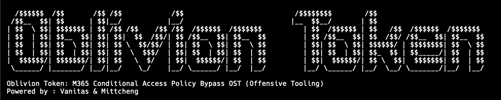

<h1 align="center">Oblivion Token</h1>
<p align="center"><i>M365 Conditional Access Policy Bypass OST (Offensive Tooling) Powered by : Vanitas & Mittcheng</i></p>
<p align="center">


</p>



## Overview
Oblivion Token is a focused offensive-research utility that makes Microsoft 365 Conditional Access Policy (CAP) bypass testing practical, repeatable, and scriptable. Designed for red-teamers and security researchers, it systematizes token-centric workflows and exercises policy edge cases to expose where device, network, or app-context assumptions fail including realistic test paths against Microsoft first-party (built-in) applications.

The tool issues legitimate OpenID Connect (OIDC) ID tokens and OAuth2 access tokens that are directly consumable by Microsoft Graph API endpoints, and it integrates seamlessly with Microsoft Graph PowerShell and GraphRunner for scripted verification, automation, and post-exploitation actions via M365 target tenants.

Binary-only distribution. No source code is included in this repository. Release artifacts include a Windows executable (`OblivionToken.exe`).

> **Support Scope:** Oblivion Token exclusively targets Microsoft Graph API resources and scopes. Non-Graph APIs (for example, Azure Management or Intune admin endpoints) are out of scope.

## Features and Key capabilities
- **Authorization Orchestration:** – Manages desktop-equivalent redirects and preserves session continuity.
- **Client Profile Catalog:** – Reads tenant-ready registrations from `clients.json` with optional scope overrides.
- **Credential Flexibility:** – Supports interactive prompts or sanctioned secrets in `creds.json`.
- **Adaptive MFA Handling:** – Guides MFA Push Notification, Microsoft Authenticator OTP, and SMS Verifications until completion or timeout.
- **Evidence Output:** – Prints access and refresh tokens, scope summaries, and optional `/me` context.
- **Token-centric orchestration:** for repeatable CAP bypass experiments.
- **First-Party App Support:** Compatible with Microsoft’s built-in and first-party applications.
- **Graph API Integration:** Emits valid OIDC ID tokens and OAuth2 access tokens for use with Microsoft Graph API post-exploitation automation (Especially beneficial convenient for Microsoft Graph PowerShell module and GraphRunner offensive tool).
- **Ethical & Verifiable Use:** Designed for authorized testing, with transparent, reproducible results.

## Installation

### Use a Release

Pre built x64/ARM binaries are in the release directory.

## Usage
### Prerequisites
- Windows 10/11 host with outbound access to Microsoft identity and Microsoft Graph endpoints.
- `clients.json` populated with tenant-approved registrations and stored beside the executable or Python script.
- Optional `creds.json` containing sanctioned credentials for unattended lab runs.
```powershell
PS C:\OblivionToken> .\OblivionToken.exe

  /$$$$$$  /$$       /$$ /$$            /$$                           /$$$$$$$$        /$$
 /$$__  $$| $$      | $$|__/           |__/                          |__  $$__/       | $$
| $$  \ $$| $$$$$$$ | $$ /$$ /$$    /$$ /$$  /$$$$$$  /$$$$$$$          | $$  /$$$$$$ | $$   /$$  /$$$$$$  /$$$$$$$
| $$  | $$| $$__  $$| $$| $$|  $$  /$$/| $$ /$$__  $$| $$__  $$         | $$ /$$__  $$| $$  /$$/ /$$__  $$| $$__  $$
| $$  | $$| $$  \ $$| $$| $$ \  $$/$$/ | $$| $$  \ $$| $$  \ $$         | $$| $$  \ $$| $$$$$$/ | $$$$$$$$| $$  \ $$
| $$  | $$| $$  | $$| $$| $$  \  $$$/  | $$| $$  | $$| $$  | $$         | $$| $$  | $$| $$_  $$ | $$_____/| $$  | $$
|  $$$$$$/| $$$$$$$/| $$| $$   \  $/   | $$|  $$$$$$/| $$  | $$         | $$|  $$$$$$/| $$ \  $$|  $$$$$$$| $$  | $$
 \______/ |_______/ |__/|__/    \_/    |__/ \______/ |__/  |__/         |__/ \______/ |__/  \__/ \_______/|__/  |__/

Oblivion Token: M365 Conditional Access Policy Bypass OST (Offensive Tooling)
Powered by : Vanitas & Mittcheng
```

### Baseline Authorization (No MFA)
Provide the requested username and password (unless stored in `creds.json`), select a client profile.

https://github.com/user-attachments/assets/65f136d0-93e7-4d74-92c4-d3c363f5c93d

```powershell
Enter username (UPN/email): user@tenant
Enter password: 
Select Target Clients:
  1) Microsoft Intune Company Portal
  2) Microsoft Authenticator App
  3) ZTNA Network Access Client
  4) ZTNA Network Access Client -- Private
  5) ZTNA Network Access Client -- M365
  6) UnPublic App [1]
  7) UnPublic App [2]

Enter number: 2
```

### MFA Authorization
Provide the requested username and password (unless stored in `creds.json`), select a client profile, and follow any MFA instructions.

https://github.com/user-attachments/assets/0379ea97-ebdc-42da-9ab1-8889a51cd0a8

```powershell
Enter username (UPN/email): user@tenant
Enter password: 
Select Target Clients:
  1) Microsoft Intune Company Portal
  2) Microsoft Authenticator App
  3) ZTNA Network Access Client
  4) ZTNA Network Access Client -- Private
  5) ZTNA Network Access Client -- M365
  6) UnPublic App [1]
  7) UnPublic App [2]

Enter number: 2

[-] MFA Required.

Choose Authentication Method:
  1) Push notification
  2) Authenticator One-Time Password Code
  3) SMS
```
#### Microsoft Authenticator Push
Issues a push notification, monitors Microsoft’s verification status, and resumes authorization when the request is approved or reports a timeout on failure.
```powershell
[-] MFA Required.

Choose Authentication Method:
  1) Push notification
  2) Authenticator OTP
  3) SMS

Enter number: 1
Approve sign-in with number (You have 40s to Proceed): 82
```
#### Authenticator OTP
Prompts for a six-digit app code, validates the entry via Microsoft’s verification service, and continues the flow once confirmed.
```powershell
[-] MFA Required.

Choose Authentication Method:
  1) Push notification
  2) Authenticator OTP
  3) SMS

Enter number: 2
Enter 6-digit Authenticator One-Time Password Code: 112233
```
#### SMS Verification Code
Requests a texted challenge, tracks Microsoft’s response, and completes the sign-in when the code is accepted.
```powershell
[-] MFA Required.

Choose Authentication Method:
  1) Push notification
  2) Authenticator OTP
  3) SMS

Enter number: 3
Enter 6-digit SMS Verification Code: 112233
```

### User-Agent Selection (Optional)

This feature is **optional** and primarily intended for advanced research scenarios. 
By default, Oblivion Token uses a **standard Windows/Edge User-Agent** string for all authorization flows.  
Operators may override this behavior to emulate specific devices or browsers when testing Conditional Access Policy reactions to different client signals.

- `--device` picks a built-in platform signature (default `Windows`).
- `--browser` swaps the browser fingerprint for that device (defaults to the common choice per platform).
- `--user-agent` accepts a full custom string when you need an exact header.
- `--list-user-agents` prints every device/browser combination and their corresponding strings, then exits.
- Example: `OblivionToken.exe --device Mac --browser Safari`

```powershell
PS C:\OblivionToken> .\OblivionToken.exe -h
usage: OblivionToken.exe [-h] [--user-agent USER_AGENT_OVERRIDE] [--device DEVICE] [--browser BROWSER] [--list-user-agents]

Conditional Access Bypass Research Tool

options:
  -h, --help            show this help message and exit
  --user-agent USER_AGENT_OVERRIDE
                        Override the User-Agent string explicitly.
  --device DEVICE       User-Agent device profile (default: Windows). Options: Mac, Windows, AndroidMobile, iPhone, Linux, OS/2, PlayStation. Use
                        --list-user-agents for mappings.
  --browser BROWSER     User-Agent browser signature. Defaults to the common browser for the selected device. Options: Android, IE, Chrome, Firefox,
                        Edge, Safari.
  --list-user-agents    Print available device/browser combinations and exit.
```

## Token Redemption Example
```text
======= Successfully Redeemed Tokens =======

[*] MS Graph API Access Token:

eyJ0eXAiOiJ...<snip>

[*] Refresh Token:

1.ASYAn98Rj...<snip>

=========== Oblivion Token Result ===========

Status: SUCCESS
Client: Microsoft Intune Company Portal
AppId: 9ba1a5c7-f17a-4de9-a1f1-6178c8d51223
Scope: email openid profile https://graph.microsoft.com/Organization.Read.All https://graph.microsoft.com/UserAuthenticationMethod.Read https://graph.microsoft.com/UserAuthenticationMethod.ReadWrite https://graph.microsoft.com/.default

[*] Current User Informations:

{
  "@odata.context": "https://graph.microsoft.com/v1.0/$metadata#users/$entity",
  "businessPhones": [],
  "displayName": "John Doe",
  ...
}

=============================================
```

## Configuration
### Client Profiles (`clients.json`)
`clients.json` governs client selection and supports the following fields:

| Field          | Required | Description |
|----------------|----------|-------------|
| `name`         | Yes      | Friendly display name presented to the operator. |
| `client_id`    | Yes      | Application (client) ID registered within Microsoft Entra ID. |
| `redirect_uri` | Yes      | Redirect URI approved for the registration and authorization grant. |
| `scope`        | No       | Space-delimited scope string; defaults to Microsoft Graph delegated access. |
| `resource`     | No       | Optional resource identifier for legacy consent scenarios. |

Example:
```json
[
  {
    "name": "Microsoft Intune Company Portal",
    "client_id": "9ba1a5c7-f17a-4de9-a1f1-6178c8d51223",
    "redirect_uri": "ms-appx-web://Microsoft.AAD.BrokerPlugin/9ba1a5c7-f17a-4de9-a1f1-6178c8d51223"
  }
]
```

### Credential Profiles (`creds.json`)
`creds.json` provides optional credential reuse:
```json
{
  "username": "user@tenant",
  "password": "P@ssw0rd"
}
```

## PowerShell Integration
Tokens emitted by Oblivion Token can authenticate Microsoft Graph workloads without browser prompts.
```powershell
$token = "eyJhbGciOiJ..."  # Access token from Oblivion Token output
$secureToken = ConvertTo-SecureString $token -AsPlainText -Force
Connect-MgGraph -AccessToken $secureToken
Get-MgContext
```

## Important Notes
- Enforce least-privilege access on executables, JSON files, and logs that contain bearer tokens.
- Ensure host clocks, DNS, and outbound routes align with Microsoft identity services to avoid false negatives.
- Oblivion Token is optimized for Microsoft Graph; other cloud APIs may impose additional consent or policy controls.
- Console transcripts expose raw tokens; capture and store them only when policy permits and sanitize afterward.

## Future Work
- Evilginx-based integration for data collection helpers aligned with credential phishing campaigns, tailored for Conditional Access Bypass feature.

## License
This project is licensed under Apache License 2.0.

## Changelog

### v1.2 – October 24, 2025
- Added **optional User-Agent override and selection feature** for advanced research use (`--user-agent`, `--device`, `--browser`, `--list-user-agents`).
- This feature allows operators to emulate various platform and browser combinations when evaluating Conditional Access policy behavior.
- The default behavior remains unchanged. If no flags are provided, the tool uses the standard Windows/Edge User-Agent for stable testing.

### v1.1 – October 15, 2025
- Add video demonstration of the unpublic application (In-progress on Microsoft Security Response Center (MSRC) vulnerability investigation process).  

### v1.0 – October 13, 2025
- Initial repository creation and documentation setup.  
- Added Windows x64 and ARM64 binary distribution (`OblivionToken.exe`).  
- Published core README with overview, usage, MFA workflows, and configuration examples.  
- Established research scope limited to Microsoft Graph API resources and scopes.

## Knowledge Credit and References
- [Dirk-jan Mollema](https://github.com/dirkjanm) — Active Directory and Azure AD security researcher
- [Fabian Bader](https://github.com/f-bader) — Identity and cloud security researcher
- [temp43487580](https://github.com/temp43487580) — Contributor in OAuth and token research
- [TokenSmith](https://github.com/JumpsecLabs/TokenSmith) — JUMPSEC Labs project on Conditional Access bypass research
- [Sunny Chau (JUMPSEC Labs)](https://github.com/gladstomych) — Creator of TokenSmith and researcher in Microsoft identity security

## Disclaimer
Oblivion Token is intended strictly for authorized assessments and responsible security research; use only in environments where you have explicit permission.